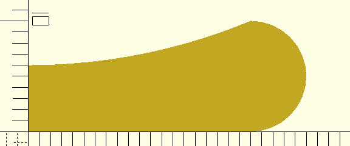
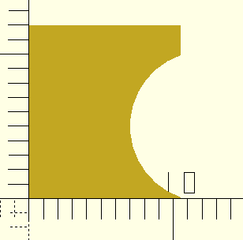
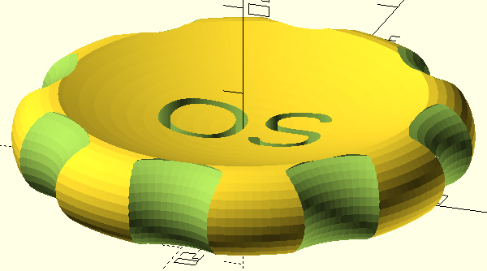
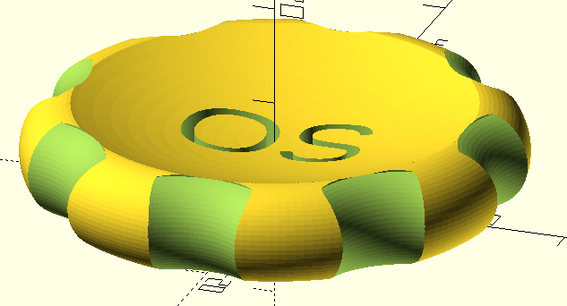

# opensource makercoin

Openscad version of [Maker's Muse Maker coin](https://www.makersmuse.com/open-source-makercoin)

Seeing the next comparision of CAD programs in light of 3D printing let me miss my favourite one, and i tried (badly) to tackle the given task.

Thanks to Jordan on the openscad discussion list, i can present you with a makecoin that nearly covers all the requirements asked of it (horizontal bevel of the cutouts are missing yet).

I add here also what i am missing on Angus site (and thus hoping he will add his own that we can see in the video), the specifications of the coin:

## specifications

### the basic shape of the coin 

values are inner diameter 20mm, inner thickness 6mm, outer rim, 10mm

, 

### cutout for the border (x8)

now the cutout, basicly cylinders of diameter 14mm, you can see i added the z-axis bevel: 

### text cutout and final result

now cutout some text out of the center, leveaing 2mm at the bottom: 

#### with $fs=1 10K vertexes:  

#### with $fs=0.5 23K vertexes: 

 

### remarks

Don't make my error to drive the resolution too high, screen resolution != printer resolution, the number of polygons to handle though, impact the comp you are working on quite significantly!

Also do in 2D what is possible, and use extrusion afterwards, every polygon you can save, reduces the computational cost.

# thanks

- A lot of thanks to the openscad community, and for this project Jason Brown especially
- mardown edited with retext 

# Licence

see [GPL](LICENSE)